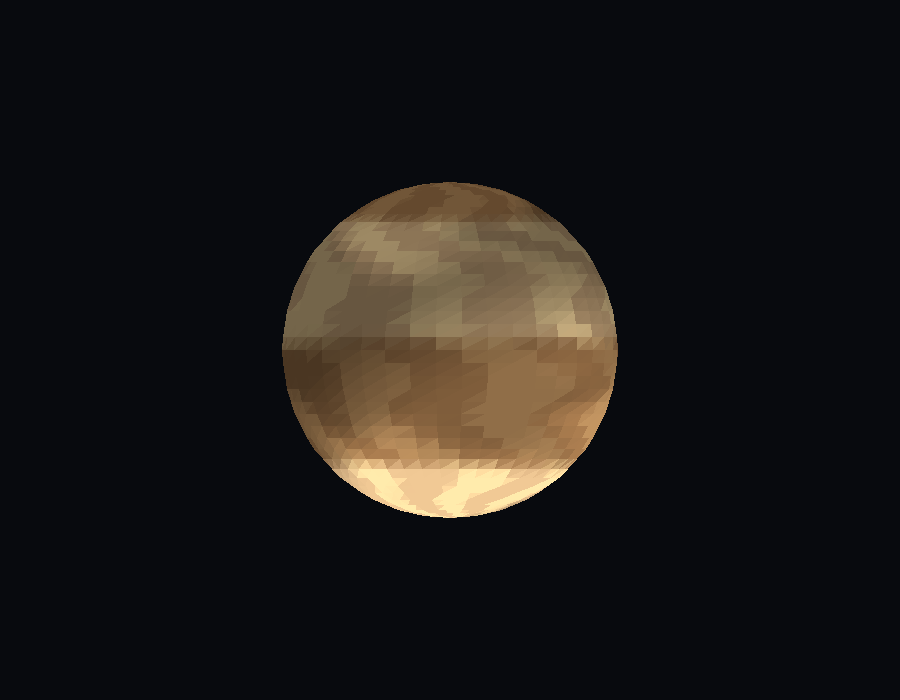
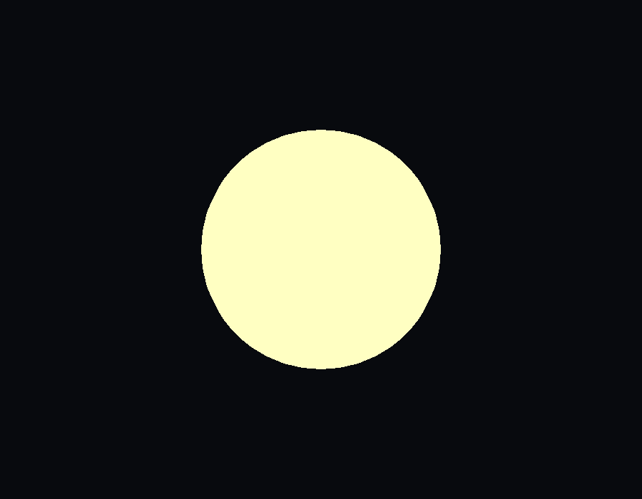
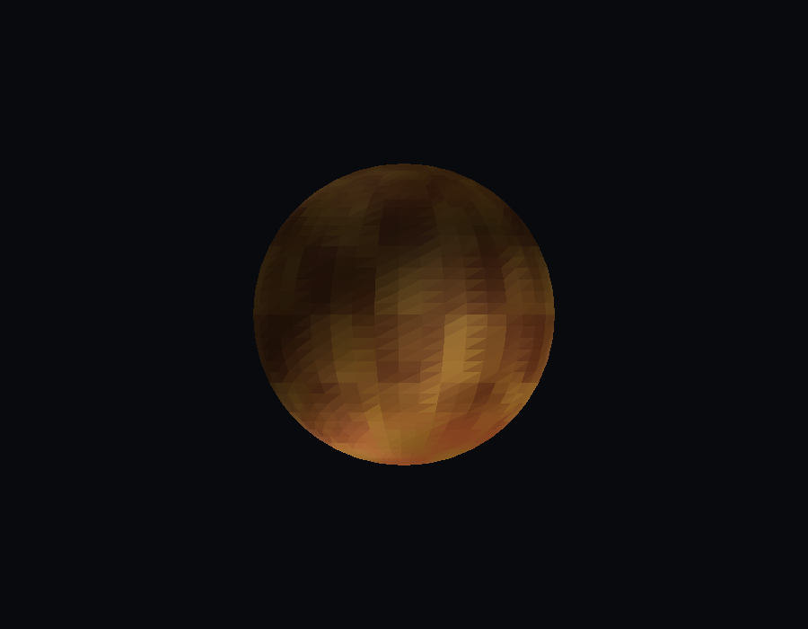

# Lab 4 - Sistema Solar Shader

Renderer 3D en Rust con múltiples modelos y shader metálico avanzado.

## Capturas

### Júpiter (Flowmap)


### Sol


### Planeta Rocoso (Marte)


### OVNI


## Características

- Sistema de carga dinámica de modelos OBJ
- Shader metálico con paneles procedurales
- Reflexiones especulares y rim lighting
- Cambio entre modelos en tiempo real

## Modelos y Shaders

1. OVNI - Shader metálico con paneles y reflexiones
2. Sol - Shader de estrella con plasma y manchas solares
3. Planeta Rocoso - Shader con terreno, cráteres y polos
4. Gigante Gaseoso - Shader con bandas atmosféricas y tormenta

## Controles

- 1/2/3/4 - Cambiar modelo
- A/D - Rotar horizontal
- W/S - Rotar vertical
- +/- - Zoom
- C - Toggle aplanado
- B - Toggle backface culling
- R - Reset cámara
- P - Guardar PNG
- ESC - Salir

## Generación de Esferas

```bash
python3 generate_spheres.py
```

## Ejecución

```bash
cargo run --release
```

## Tecnologías

- Rust 2024
- minifb
- nalgebra-glm
- tobj
- image